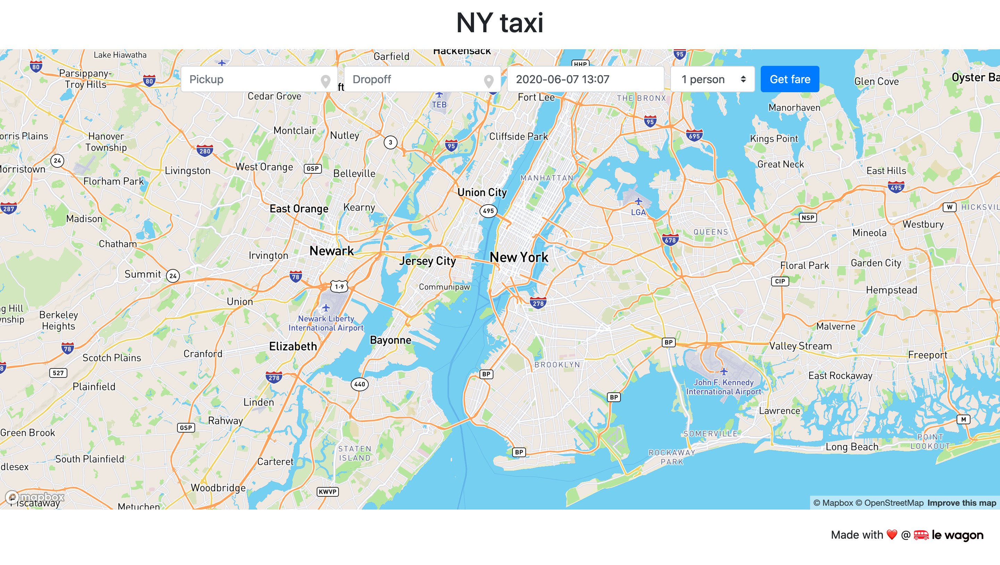

# Taxi Fare Interface

Lightweight frontend for fare prediction APIs, with optional map routing and place autocomplete.

## Features
- Pickup/dropoff selection with Mapbox geocoder (optional).
- Datetime and passenger count inputs.
- GET request to configurable fare prediction API.
- Predicted fare display with request status feedback.
- Route visualization when a Mapbox token is configured.

## Stack
- Vanilla HTML/CSS/JavaScript
- Mapbox GL JS + Mapbox Geocoder
- Flatpickr

## Configuration
Create or update `config.js`:

```js
window.APP_CONFIG = {
  taxiFareApiUrl: "https://YOUR_API_URL/predict",
  mapboxToken: "YOUR_MAPBOX_PUBLIC_TOKEN"
};
```

Notes:
- `mapboxToken` is optional. Without it, map and geocoders are disabled gracefully.
- `taxiFareApiUrl` is required for fare prediction.
- Only public browser-safe tokens should be used here.

## Run Locally
```bash
python -m http.server 5001
```

Open:
- `http://localhost:5001`

## Preview


## API Contract
Expected query parameters:
- `pickup_latitude`
- `pickup_longitude`
- `dropoff_latitude`
- `dropoff_longitude`
- `passenger_count`
- `pickup_datetime`

Expected response:
```json
{ "fare": 12.34 }
```

## Security and Privacy
- No private secrets should be committed.
- Keep any environment-specific settings out of version control.
- Use `config.example.js` as the template baseline.
